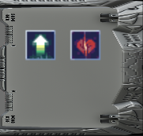

## Índice

- [1. Historia](#1-historia)
    - [1.1. Personajes aliados](#11-personajes-aliados)
        - [1.1.1. Squad Leader](#111-squad-leader)
        - [1.1.2. Radio Operator](#112-radio-operator)
        - [1.1.3. Anti Tank](#113-anti-tank)
        - [1.1.4. Sniper](#114-sniper)
    - [1.2. Enemigos](#12-enemigos)
        - [1.2.1. Wasp](#121-wasp)
        - [1.2.2. Hornet](#122-hornet)
        - [1.2.3. Scarab](#123-scarab)
- [2. Pantallas](#2-pantallas)
    - [2.1. Pantalla de inicio](#21-pantalla-de-inicio)
    - [2.2. Menu principal](#22-menu-principal)
    - [2.3. Tutorial](#23-tutorial)
    - [2.4. Misión 1: Patrulla](#24-misión-1-patrulla)
    - [2.5. Misión 2: Buscar y destruir](#25-misión-2-buscar-y-destruir)
    - [2.6. Misión 3: Rescate](#26-misión-3-rescate)
    - [2.7. Créditos](#27-créditos)
- [3. Diseño](#3-diseño)
    - [3.1. Cursor](#31-cursor)
    - [3.2. Control de Audio](#32-control-de-audio)
    - [3.3. Localización del juego](#33-localización-del-juego)
    - [3.4. Cuadro de dialogos](#34-cuadro-de-dialogos)
    - [3.5. Cámara](#35-cámara)
    - [3.6. Seleccionar unidades](#36-seleccionar-unidades)
        - [3.6.1. Seleccionar una unidad](#361-seleccionar-una-unidad)
        - [3.6.2. Seleccionar varias unidades](#362-seleccionar-varias-unidades)
    - [3.7. Barra de salud superior](#37-barra-de-salud-superior)
    - [3.8. La interfaz con los detalles de la unidad](#38-la-interfaz-con-los-detalles-de-la-unidad)
    - [3.9. Habilidades de los soldados](#39-habilidades-de-los-soldados)
        - [3.9.1 Habilidades de selección de area](#391-habilidades-de-selección-de-area)
        - [3.9.2. Habilidades de area](#392-habilidades-de-area)
        - [3.9.3. Habilidades de selección](#393-habilidades-de-selección)
    - [3.10. Cooldown de las habilidades](#310-cooldown-de-las-habilidades)
    - [3.11. El minimapa (sin completar)](#311-el-minimapa-sin-completar)
    - [3.12. Movimiento de las unidades](#312-movimiento-de-las-unidades)
    - [3.13. IA de los aliados](#313-ia-de-los-aliados)
    - [3.14. IA de los enemigos](#314-ia-de-los-enemigos)
- [4. Cosas que han faltado](#4-cosas-que-han-faltado)
- [5. Recursos de terceros utilizados](#5-recursos-de-terceros-utilizados)

# 1. Historia
El juego se situa en un futuro no muy lejano. Donde la humanidad esta siendo atacada por máquinas con forma de insectos. Para combatirlas se han formado diferentes escuadrones que luchasn contra ellas realizando guerra de guerrillas. Nuestra misión es asumir el rol de comandante de uno de estos escuadrones y luchar contra estos enemigos en diferentes escenarios.

## 1.1. Personajes aliados

### 1.1.1. Squad Leader
Unidad equilibrada, dispone de una buena cantidad de salud y armadura y dispone tanto de habilidades de ataque como de apoyo. Puede estar en el frente y en la retaguardia.
Habilidades:
- Granada de Fragmentación: Lanza una granada que hace una cantidad de daño a los enemigos en un area concreta.
- Buff velocidad de ataque: En un area determinada hace que los aliados ataquen más deprisa durante un corto período de tiempo.
- Cura: Cura una cantidad moderada de salud a una unidad aliada.

> Imagen de la unidad

> Imagen de detalle de la unidad

### 1.1.2. Radio Operator
El operador de radio es una unidad de apoyo. Dispone de una cantidad de salud y armadura moderada, por lo que puede recibir una cierta cantidad de ataques. no obstante esta pensada para que este a media distancia apoyando a el resto de unidades.
Habilidades:
- Granada de sanación: Lanza una granada que sana a todos los aliados dentro del alcance.
- Buff armadura: Aumenta la armadura de todos los aliados cercanos durante un breve período de tiempo.

> Imagen de la unidad

> Imagen de detalle de la unidad

### 1.1.3. Anti Tank

Unidad con mucha salud y armadura, ideal para estar en el frente. Presenta un ataque potente y lento. Sus habilidades estan enfocadas a la ofensiva.
Habilidades:
- Disparo potente: Ataque que hace mucho daño a una unidad enemiga.
- Buff de ataque: Aumenta el ataque de los aliados durante un breve período de tiempo.

> Imagen de la unidad

> Imagen de detalle de la unidad

### 1.1.4. Sniper

La francotiradora tiene el ataque más elevado de todos y a la vez el más lento. Como buena francotiradora que es su rango de ataque es superior que el resto de unidades.
Tiene poca salud y armadura por lo que no debería de estar en primera línea de fuego. Es una unidad de apoyo.
Habilidades:
- Buff energía: Aumenta la regeneración de energía de todos los aliados cercanos.
- Buff salud: Aumenta la regeneración de salud de todos los aliados cercanos.

> Imagen de la unidad

> Imagen de detalle de la unidad

## 1.2. Enemigos

### 1.2.1. Wasp
Es el enemigo más básico de todos. Su función simplemente es hacer bulto. No es hostil hacia los soldados por lo que solo es una esponja de balas. Tiene poca salud.

### 1.2.2. Hornet
Este es un enemigo volador que ataca a distancia. A diferencia del enemigo anterior este si que es hostil hacia los soldados. Presenta un ataque bajo, una velocidad de ataque rápida y una salud media.

### 1.2.3. Scarab
Unidad enemiga a melee. Esta unidad hace un daño moderado a corto alcance y dispone de muchos puntos de salud.

# 2. Pantallas

## 2.1. Pantalla de inicio
La pantalla de inicio muestra el logo de la empresa. En mi caso como es una práctica de la UOC he decidido utilizar su logo. La escena ejecuta una corutina donde hace una transición inicial de un segundo. Después espera tres segundos para dar tiempo al jugador de ver el logo. Finalmente se hace la animación de salida de un segundo.

## 2.2. Menu principal
El menú principal entra con una transición en negro y muestra una ciudad con parallax de fondo, el título del juego y las opciones que tiene disponible el jugador en el menú principal. Estas opciones son: Jugar la camapaña, ir a opciones, ver los créditos y salir de la aplicación.

## 2.3. Tutorial
El primer nivel implementado es un pequeño escenario donde mediante diálogos se le explica al jugador los controles básicos del juego. En este nivel el jugador no puede perder de ninguna forma. El jugador solo debe ir mirando los diálogos e ir llegando a los diferentes checkpoints que hay en el mapa. Para ello vamos a dejar que solo disponga de una unidad que gestionar, el Líder de escuadrón.

## 2.4. Misión 1: Patrulla
La primera misión consiste en realizar una patrulla por un punto determinado. Podríamos resumir esto en llegar del punto A al punto B. En este nivel ponemos a disposición del jugador dos unidades: El líder de escuadrón y la operadora de radio.
A partir de este nivel el jugador si que va a poder perder la partida. En este caso el jugador pierde si todas las unidades mueren antes de completar el objetivo.
En este mapa no es obligatorio matar a todos los enemigos y el jugador puede evitar algunos combates si asi lo desea.

## 2.5. Misión 2: Buscar y destruir
En este nivel no hay punto de destino, el jugador debe explorar todo el mapa y eliminar a todos los enemigos sin excepción. En el momento en el que el último enemigo sea derrotado se cumplirá la condición de victoria y el jugador habrá superado el nivel.
Aquí añadimos una nueva unidad al escuadrón, el anti tanque.

## 2.6. Misión 3: Rescate
En la misión final el jugador deberá llegar lo más rápido posible a un punto para ayudar a un grupo de gente que eta siendo atacada.
Para la misisón final subimos un poco más el nivel y ponemos al jugador una nueva condición de derrota, el tiempo. Dispone de 30 min para llegar al punto indicado o perderá la partida. Para ayudarle en la tarea le incorporaremos el último mienbro del escuadrón, la francotiradora.

## 2.7. Créditos
La pantalla de créditos muestra el autor y todos los recursos y autores de los assets utilizados en la práctica. La pantalla esta dividida en dos partes: En la parte izquierda un fondo con parallax y en la derecha los créditos.
He pensado que poner una pantalla en negro con los créditos es muy aburrido. Por eso he decidido partir la escena en dos. Por otro lado la información que se muestra en los créditos esta almacenada en un fichero y se carga en el momento de empezar la escena. 
La escena se puede terminar de dos formas. La primera es por la interacción del usuario, si este hace clic con el botón izquierdo del ratón o pulsa la tecla escape la escena termina y se pasa al menú principal.
La segunda es cuando el texto de los créditos llega a la posición final. En ese momento la escena finaliza automáticamente.
Tanto en la entrada como en la salida de la escena se reproduce una transición de un segundo para que no se vea que el cambio se hace abruptamente.

# 3. Diseño

## 3.1. Cursor
En los juegos de estrategia en general el cursor es uno de los elementos más importantes dado que sirve tanto para la jugabilidad como para indicar al usuario que puede o no puede hacer. En mi caso he decidido cambiar la imagen del cursor por una diferente, más minimalista. 
> Cursor.SetCursor(alyCursorTexture, Vector2.zero, CursorMode.ForceSoftware);

Después he querido implementar el cambio de cursor dependiendo el tipo de unidad a la que esta apuntando para facilitar al usuario la diferenciación de las unidades en pantalla. Para hacer esto tengo un script donde en cada FixedUpdate hace un RayCast hacía la posición donde esta el cursor. Seguidamente es mirar si ha chocado con algo y si el tag es de un soldado o un enemigo.

## 3.2. Control de Audio
En esta práctica he querido implementar ajustes de audio en el menú de opciones del menú principal. He dividido el audio en dos partes: Volumen general (música de fondo) y efectos (disparos, voces..). Para regular esto lo mejor que he visto es el uso de Sliders. Así el jugador puede ver de una forma clara que cantidad tiene de cada uno y modificarlo de una forma sencilla.
He fijado los parámetros de 0 a 100.
Hacer esto implica que los Audio Source deben ser modificados. He investigado como hacer esto y he encontrado los Audio Mixers. Con el Audio Mixer he creado dos grupos separados del Master, uno para background y otro para efectos.

Ahora solo hace falta en cada Audio Source especificar debajo del clip el Grupo del Mixer que queremos usar.
Para guardar la configuración he tenido unos cuantos problemas. Como se puede apreciar los valores del Mixer son en decibelios, de .80 a 20. En cambio mi Slider esta en porcentage. Este valor se tiene que convertir a decibelios. Esto he tenido que buscarlo por internet y he dado con esta fórmula:
> float db = 20 * Mathf.Log10(gameInfo.generalVolume / 100);

Finalmente se ponen los valores en el Audio Mixer y ya tenemos el audio configurable.

## 3.3. Localización del juego

En la PEC 3 ya implementé este sistema solo he reaprovechado el conocimiento y añadido las traducciones del juego nuevo. Esto se puede consultar en el Readme de la PEC3 .
- <a href="https://gitlab.com/rgarridovaldepenas/pec-3" target="_blank">PEC 3</a>

## 3.4. Cuadro de dialogos
He reaprovechado el sistema de dialogos de la PEC anterior. En este caso le he dado un lavado de cara a la caja que se muestra para que tenga mas concordancia con el tipo de juego en el que estamos.

## 3.5. Cámara
Prácticamente todos los tipos de juegos de estratégia permiten al jugador mover la cámara acercando el ratón a los bordes. Para implementar esto tengo un script adjuntado a la cámara que se encarga de comprobar en cada Update si la posición del ratón esta en uno de los bordes de la pantalla. Si es así desplazará la cámara en el eje de esa dirección. Para simplificar esto no hago diagonales, solo me limito al eje vertical y horizontal.
Eso en cuanto a movimiento de la cámara, lo que pasa es que también es habitual dejar al jugador la posibilidad de acercar o alejar la posición de la cámara. En mi caso he preferido jugar con el <b>Orthographic Size</b> de la cámara. Si detecto que la rueda del ratón va hacía arriba entonces disminuyo el valor para que parezca que la cámara se va hacercando. Hago lo opuesto para cuando gira la rueda hacia abajo. Para evitar cosas raras he puesto unos límites en ambas acciones para que no se pueda hacer demasiado zoom ni demasiado poco.

>  Imagen con zoom normal

> Imagen con zoom al máximo

## 3.6. Seleccionar unidades

En todo buen juego de estratégia se tiene que poder seleccionar una o varias unidades alidas. Por lo que he querido implementar esta función. Normalmente para seleccionar unidades al jugador se le dan dos opciones: Hacer clic en una unidad para seleccionarla o arrastrar el ratón para seleccionar todas las unidades dentro del cuadro que se forma al mover el ratón. He implementado los dos métodos.

### 3.6.1. Seleccionar una unidad
Para la selección de una unidad he cogido y en el Update miro cuando se aprieta el botón izquierdo del ratón SOLO CUANDO SE APRIETA. En ese momento cojo la posición del ratón y la proyecto en una posición del plando de la escena para hacer un ray cast en esa posición. Si toco una unidad aliada la selecciono. Si no no ocurre nada. Si se da el caso de que ya teníamos una unidad seleccionada vamos a deseleccionarla.

> Imagen sin una unidad seleccionada

> Imagen con una unidad seleccionada

Para informar al usuario de que tiene la unidad seleccionada muestro un pequeño círculo verde debajo de la unidad. Además se puede ver que la interfaz de usuario se ha vuelto más compleja pero eso lo dejamos para más adelante.

### 3.6.2. Seleccionar varias unidades
Para seleccionar más unidades hay que hacer algo más complejo. En primer lugar tenemos que mirar cuando el jugador pulsa el botón izquierdo del ratón. En este punto me quedo con la posición. Seguidamente añado una condición en la que solo entro si el jugador tiene el botón izquierdo mantenido. En este punto lo que hago es coger la posición actual y la posición inicial para dibujar el cuadrado.
En mi caso he querido mantener el mismo color que el de la selección de la unidad para que el jugador vea la relación.
Pues bien con las dos posición que tengo, lo que tengo són los lados de cada extremo del cuadrado por lo que puedo calcular y dibujar todo el cuadrado:
> Posición inicial (x1, x1)

> Posición actual (x2, y2)

> Tercera posición (x1, y2)

> Cuarta posición (x2, y1)

Ahora puedo añadir un LineRenderer y le indico estos cuatro puntos para que los dibuje. Como esta en el update el cuadrado se irá redimensionando a medida que el jugador mueve el cursor.

Finalmente en el momento en el que se levanta el dedo del botón izquierdo hago un Ray Cast del tipo BoxCastAll. Lo que pasa es que para hacer esto tengo que indicar el centro del cuadrado y su tamaño. Para calcular el centro del cuadrado se pueden coger y sumar las posiciones de los cuatro lados del cuadrado y dividir el resultado por el número de lados. Para el tamaño solo hace falta saber la distancia entre la posición inicial y la posición final
>                var size = new Vector3(
>                    Mathf.Abs(startMousePosition.x - currentMousePosition.x),
>                    Mathf.Abs(startMousePosition.y - currentMousePosition.y),
>                    0f
>                );

Finalmente solo queda recorer todo el array y seleccionar todas las unidades que sean aliadas.
Para seleccionar una unidad en la clase controller tienen un método public que se encarga de mostrar la unidad seleccionada y la barra de salud superior.

## 3.7. Barra de salud superior

He querido separar esto porque me ha dado algunos problemas esta implementación. Este elemento suele estar presente en todos los jeugos de estratégia y permite el jugador que pueda ver de una forma rápida la salud de todas las unidades que tiene seleccionadas sin tener que ir una por una.
Normalmente este elemento debería ir dentro de un Canvas pero he decidido no hacerlo por varios motivos. En primer lugar ya tengo un canvas muy complicado con la UI de la unidad (llegaremos a eso más adelante) y segundo no quería estar mirando que ese objeto se ponga en la posición del soldado.
Mi solución ha sido poner un GameObject con dos hijos. El primero contiene la barra roja, y el segundo la verde. La barra roja se renderiza en una posición anterior a la verde de manera que va a quedar siempre detrás.
Este enfoque tiene un problema, no puedo poner un slider y jugar con el tamaño mediante las funciones que proporciona este. En su lugar lo que hago es reducir el ancho del sprite. Esto genera un problema y es que reduce el Sprite por los dos lados de forma que no cumple con lo que queremos. Para arreglar esto tengo un offset que voy añadiendo dependiendo de la cantidad de salud que le falta a la unidad. De esta manera a medida que va perdiendo salud disminuyo el sprite y lo alineo a la derecha. Con esto doy la sensación de que la barra de salud "Esta bajando" y no tengo que gestionar esto desde un Canvas.

>         // Scale sprite
>        remainingHealth.GetComponent<SpriteRenderer>().size = new Vector2((float)(currenthealth * 1) / healthPoints, 0.25f);
>        // Adjust position
>        float offset = (0.5f / healthPoints);        
>        Vector3 newPosition = new Vector3(healthbar.transform.position.x - offset * (healthPoints - currenthealth), remainingHealth.transform.position.y, > remainingHealth.transform.position.z);
>        remainingHealth.transform.position = newPosition;

## 3.8. La interfaz con los detalles de la unidad
Aquí llegamos a uno de los puntos que tiene más detalles. La interfaz de la unidad. Permite al jugador que sepa si tiene una unidad seleccionada y los atributos que tiene. En mi caso a parte de esto he añadido habilidades y el minimapa.

> UI sin unidad seleccionada

> UI con la unidad seleccionada.

Empezamos por la parte estética, en un canvas tengo la imagen de la cuadrícula y le he añadido las partes grises de la derecha y la que se encuentra cerca del cuadro de la izquierda.
El resto de elementos son hijos de esta. De esta manera puedo desactivar el GameObject cuando no tengo ninguna unidad seleccionada.
Cuando tengo una unidad seleccionada muestro la imagen de la unidad y los principales atributos, asi como el nombre y las habilidades que puede realizar.
La parte de la izquierda quedaría reservada para el minimapa.
Cuando se da el caso de que selecciono múltiples unidades los datos que se muestrán son del primero que se encuentra.
En la interfaz se puede ver la imagen del soldado, sus puntos de salud totales y actuales así como la energía.
La energía es un recurso que se utiliza para lanzar habilidades. Cada personaje tiene la suya y se regenera con el tiempo a razón de 1 por segundo (con una corutina).
En cuanto las habilidades, son botones asociados a cada soldado. De manera que el seleccionar una unidad mostraremos los botones que tiene asociados.
Para facilitar la comprensión de las habilidades he añadido un pequeño tooltip que se muestra cuando el jugador deja el cursor encima del botón 1,5 segundos. Y se esconde cuando deja de señalar el botón.

Para hacer esto he añadido un Evento al Botón saber cuando entra el cursor dentro del botón. También he añadido otro evento para detectar la salida del cursor.
Cuando salta el evento de entrada se ejecuta una corutina que al cabo de 1.5 segundos muestra el tooltip y llena el texto con la información del botón al que estamos apuntando.
Por otro lado cuando salta el evento en el que el cursor deja de estar encima del bóton se esconde el tooltip. Para evitar cosas raras también he añadido que pare la Corutina por si se da el caso en el que simplemente a pasado el cursor rápidamente por encima del botón.

## 3.9. Habilidades de los soldados
Cada soldado dispone de habilidades diferentes y únicas y esto se refleja en esta pequeña parte de la interfaz.

Las habilidades se pueden dividir en tres tipos:
- Habilidades de selección de area: Estas indican un área concreta del mapa y su efecto se produce dentro de esta area. De este tipo tenemos las que afectan solo a aliados y las que afectan solo a enemigos.
- Habilidades de area: Una habiliad que activa su efecto a todas las unidades dentro de un rango determinado.
- Habilidades de selección: Habilidad que solo afecta a una unidad, la que se ha seleccionado. De este tipo tenemos las que afectan solo a aliados y las que afectan solo a enemigos.

### 3.9.1 Habilidades de selección de area
Cuando se pulsa en el botón de esta habilidad se muestra el rango de esta y la zona a la que afecta.
En el caso de que la habilidad afecte a los enemigos el area de acción será roja:

En el caso de que sea para los aliados será de color verde.

En las imágenes podemos ver dos areas: La blanca translúcida y la del círculo.
La primera se proyecta desde la posición del soldado y tiene un tamaño igual al area de alcance de la habilidad. Si usamos la habilidad con el cursor dentro de esta area la habilidad será lanzada. Si estamos fuera del area no ocurrirá nada.
Internamente, cuando pulsamos el botón de este tipo de habilidad indicamos que estamos utilizando una habilidad de selección por lo que las unidades ni se moverán ni atacarán. En el momento de hacer clic con el botón izquierdo miramos si la posición del cursor esta dentro del rango de la habilidad. Esto es un valor que hace de radio para trazar el circulo. Si esta dentro se hace un BoxCastAll con el diámetro del area de effecto y todos los enemigos dentro del area son notificados de que han sido alcanzados. 
Cuando la habilidad sea lanzada correctamente se mostrará la animación y el sonido. La habilidad entrara en cooldown y consumirá energía a la unidad.
Ocurre la misma funcionalidad para el caso de la habilidad que afecta a los aliados.

### 3.9.2. Habilidades de area
Estas habilidades solo afectan a los aliados que estén dentro de su rango. El funcionamiento es simple. Pulsamos el botón, se ejecuta la habilidad y afecta a todas las unidades que estén al alcance.
Esto lo hace con un CircleCastAll tomando como posición la posición del soldado que ejecuta la habilidad, y el radio como el alcance de la habilidad.
Para mostrar un poco de feedback al jugador, todos los aliados que hayan sido afectados por la habilidad mostrarán un sistema de partículas.

Cada habilidad tiene una llamada diferente pues cada uno modifica diferentes atributos durante un tiempo diferente. Esto se controla con el método que llamo a todas las unidades dentro del area. Mediante una corutina se añade el efecto, se modifican los valores y pasado el tiempo de actuación se restauran los valores originales.

### 3.9.3. Habilidades de selección

Estas habilidades solo afectan a la unidad seleccionada. Su funcionamento es similar a las habilidades de area. A partir del momento en el que se activa la habilidad, mostramos un círculo blanco mostrando el area de efecto y un puntero para indicar que solo afecta a una unidad. Seguidamente se mira si el próximo clic izquierdo emite un RayCast y impacta con una unidad. Si la habilidad solo afecta a enemigos miramos que el objeto colisionado sea un enemigo, si es un aliado, pues un aliado.

> Habilidad que solo afecta a las unidades aliadas.

> Habilidad que solo afecta a las unidades enemigas.

En ambos casos se va a mostrar al jugador un efecto para saber si la habilidad ha estado ejecutada correctamente. En el caso de una habilidad que haga daño a los enemigos se reproducirá un clip de audio. En el caso de las habilidades que afectan a los aliados se mostrará un efecto de partículas verde.

## 3.10. Cooldown de las habilidades
En el momento en el que una habilidad se usa correctamente, se aplica su efecto, se descuenta su coste de energía y esta entra en cooldown.
Internamente los botones tienen una Image puesta como hija. Esta imagen la tengo puesta con cierta transparencia para que se pueda ver a través de ella. Ahora para dar el efecto de que esta progresando su cooldown le he añadido un slider que vaya de abajo a arriba.
Esto lo controlo con una corutina que salta en el momento en el que se usa la habilidad. Es un bucle que se ejecuta mientras el tiempo de cooldown restante sea más grande que 0. En cada vuelta espera un segundo, decrementa el valor y actualiza el valor del slider. De esta manera da el efecto de que cada segundo el indicador de cooldown se va haciendo más pequeños. Adicionalmente durante este proceso el botón se bloquea para que no se pueda volver a utilizar.
También se bloquea el botón si la unidad no tiene suficiente energía.

## 3.11. El minimapa (sin completar)
Por tema de tiempo no he podido terminar la funcionalidad del minimapa. De momento lo que tengo es una cámara secundaria con un minimap render. Esta cámara solo coge elementos que esten en la layer de minimapa.
Por otro lado tengo una imagen que muestra el render del minimap.
La idea que tenía es que cada elemento de la escena tenga una imagen cuadrada en la layer del minimap que manera que se viera el escenario de forma esquemática.

## 3.12. Movimiento de las unidades
Para implementar el movimiento de las unidades, ya sean aliadas o enemigas he utilizado el paquete Nav Mesh. Este paquete permite definir zonas por las que es posible transitar, las zonas por las que no se puede y aquellas en las que se pueda saltar. Para este caso solo he utilizado los dos primeros.
Este paquete es un poco complejo de utilizar al principio, pero mirando la documentación y varios ejemplos una vez que se entiende es un proceso bastante mecánico.
Basicamente tenemos tres elementos: El Nav Mesh (el camino por el que se puede o no mover), los obstaculos (zonas en las que no se puede mover o se pueden saltar) y los agentes (elementos que se mueven por el Nav Mesh).
En primer lugar es definir la zona por la que se puede mover el agente. Para hacer esto he creado en cada mapa un BoxCollider2D que abarca todo el mapa. Seguidamente le he añadido un NavMeshModifier para indicar que todo ese collider es "Transitable".

Seguidamente aplico el mismo método para las paredes y los diferentes elementos del escenario. Pero en este caso le indico que la zona no es "Transitable".
Una vez que tengo las zonas indicadas queda añadir el NavMeshSurface. Este componente será el encargado de crear el Nav Mesh con los parámetros que le indiquemos.

En este caso le he indicado que mire solo los elementos que sean sus hijos (todos los colliders están dentro) y que utilice los colliders como para la geometría.
Con todo esto solo queda darle al Botón de Bake y si todo a funcionado bien se crea el Nav Mesh.
En este punto si se ha creado el Nav Mesh al mirar la escena con el GameObject seleccionado podremos ver el Mesh y los caminos por los que se puede mover el Agent (Solo si tenemos el Gizmos activado).

Finalmente nos queda indicar los Agentes que se podrán mover por este mesh. Se tiene que añadir en un GameObject un Nav Mesh Agent.

Con todo esto ya tenemos todo listo para mover las unidades. Para mover un agente se puede utilizar el método SetDestination:
> agent.SetDestination(transform.position);
Después de ejecutar la línea anterior el agente se dirigirá al punto marcado si hay un camino disponible.
Aqui he tenido varios problemas. El primero es que el Mesh no se me generaba correctamente, por lo que he tenido que utilizar el Asset del Nav Mesh para 2D aunque esta algo desfasado. Esto entra en conflicto con el que tiene Unity. He leído en los foros que no pasa nada y no genera ningún tipo de problema. Pero cada vez que se inicia el editor da un error.

## 3.13. IA de los aliados

Los soldados aliados no tienen IA como tal, más bien es un comportamiento concreto para unas acciones determinadas.
En primer lugar podemos mover la unidad. Para ello debemos tener la unidad seleccionada y hacer clic con el botón derecho del ratón en una parte del mapa. En ese momento se hace un SetDestination con la posición del cursor. Si hay camino disponible se iniciará la marcha. En este momento se instanciará una animación de destino en la posición indicada que dura un par de segundos y después se destruye. Ademas el personaje tiene diferentes clips de audio con dialogos. Uno de estos se reproduce aleatoriamente al moverse.

En el caso de tener varias unidades seleccionadas todas se moverán. Lo que pasa es que no se pueden mover al mismo punto porque chocarían entre ellas. Para evitar esto lo que hago es calcular pequeños offsets en la posición dependiendo del número de unidades que tenemos seleccionadas.

Este offset lo añadido en diferentes ejes para formar un cuadrado alrededor del punto indicado.
Se de entre todas las unidades seleccionadas se mostrará la información de la primera que encontramos en la lista. Asi como las voces que se escucharán a la hora de moverse.
Para el ataque la cosa es más complicada pues aquí si que tenemos que converger en un punto. El comportamiento que siguen es el siguiente. Van hacia el punto indicado y cuando el enemigo esta al alcance paran y miran si tienen algún obstaculo para disparar. Si lo tienen realizan hasta un máximo de tres intentos de esquivarlo y si lo tienen a tiro disparan. Esto se hace mediante LineCast, se tiene que poder llegar desde la posición del soldado hasta la del enemigo sin cochar con otra cosa. En el momento que pueden disparar se activa una corutina en el que dependiendo de la velocidad de ataque se haran más o menos rápidos. Este evento se cancela si la unidad muere, se mueve o el enemigo al que ataca a muerto.
En la práctica no he conseguido que el ataque sea todo lo fluído que quiero cuando tenemos las cuatro unidades muy a menudo se estorban entre ellas. Especialmente en escenarios cerrados.

## 3.14. IA de los enemigos

Para la IA de los enemigos he querido que sea lo más simple y eficaz para el tipo de juego que estoy haciendo.
El comportamiento de los enemigos es el siguiente. Estan parados y en cada FixedUpdate mediante un CastCircleAll mira si hay objetos en su rango de ataque. Seguidamente miramos uno por uno si esta "A la vista". Para esto hago un LineCast desde la posición del enemigo hasta la posición del soldado. Si no hay ningún obstaculo pasamos a atacarlo. Por el contrario pasamos al siguiente. En el caso de que no haya ninguno a la vista se vuelve a repetir el mismo proceso.
En el momento en el que tenemos un soldado a la vista nos quedamos con su referencia. Una vez que la tenemos hacemos un SetDestination con la posición del jugador. Esta acción esta en el FixedUpdate por lo que si el soldado cambia de posición la ruta se actualizará a la nueva.
En este punto vamos mirando si la distancia con el objetivo se encuentra dentro del rango de ataque. Con esto puedo hacer que los enemigos que ataquen a distancia se paren cuando estén en rango de ataque y que los enemigos a melee vayan hasta situarse al lado del soldado.
En este punto comienza el ataque. Se hace con una corutina siempre que el soldado este dentro de nuestro rango de ataque. Esta corutina tiene el ataque y un período de espera que viene determinado por su velocidad de ataque. Esto implica que a mayor velocidad de ataque más tiempo tenemos entre ataques.
Si durante la acción de atacar mata al soldado su comportamiento pasa al estado inicial y busca más soldados en rango.

# 4. Cosas que han faltado
Como en todas las PEC de esta asignatura siempre hay cosas que me faltan por hacer. En este caso a sido terminar el mapa y mejorar el movimiento de los soldados al atacar.
Finalmente me hubiera gustado implementar la llamada "Niebla de Guerra".
Pero bueno, como un primer acercamiento a los RTS y con el tiempo que disponía creo que el resultado es aceptable.

# 5. Recursos de terceros utilizados
- Asset de escenario, mapa y unidades: <a href="https://mattwalkden.itch.io/free-robot-warfare-pack">Free Robot Warfare Pack</a>, by Matt Walkden.
- Iconos de las habiliades: <a href="https://frosty-rabbid.itch.io/rpg-ability-icons">rpg ability icons</a>, by Frosty Rabbit.
- Iconos de detalle de las unidades: <a href="https://ladadori.itch.io/realistic-avatars-for-rpg">120 Realistic avatars for RPG (ethnic, gender and age diversity)</a>, by Ladadori.
- Cursores: <a href="https://assetstore.unity.com/packages/2d/gui/icons/pixel-cursors-109256">Pixel Cursors</a>, by ClayManStudio.
- Caja de dialogo: <a href="https://assetstore.unity.com/packages/2d/gui/icons/retro-info-boxes-54147">Retro Info Boxes</a>, by Kodiak Graphics.
- Ui detalles de la unidad: <a href="https://assetstore.unity.com/packages/2d/gui/icons/sci-fi-interface-frames-10747">Sci-fi Interface Frames
</a>, by CGY (Yemelyan K.).
- Fuente de letra: <a href="https://jotson.itch.io/gravity-pixel-font">Gravity pixel font</a>, by John Watson.
- Fondo y musica de los créditos: <a href="https://ansimuz.itch.io/warped-city">Warped City</a>, by Ansimuz.
- Fondo y musica del menu principal: <a href="https://ansimuz.itch.io/warped-city-2">Warped city 2</a>, by Ansimuz.
- Botones: <a href="https://wenrexa.itch.io/ui-different01">Assets: Free UI KIT #1</a>, by Wenrexa.
- Clips de audio de los niveles: <a href="https://tallbeard.itch.io/music-loop-bundle">FREE Music Loop Bundle</a>, by TallBeard Studios.
- Voces de los personajes: <a href="https://dillonbecker.itch.io/sdap">Super dialogue audio pack</a>, by Dillon Becker.
- <a href="https://mixkit.co/free-sound-effects/gun/">Clip de audio de los disparos.</a>
- <a href="https://pixabay.com/sound-effects/search/explosion/">Clip de audio de explosión.</a>
